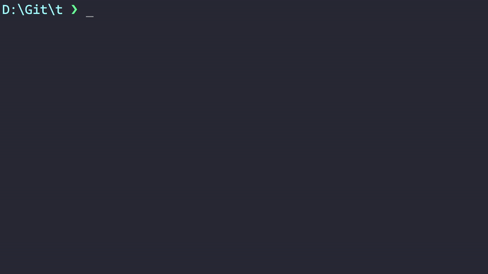

<h1 align="center" style="font-size: 55px">t</h1>
<h3 align="center">A simple terminal task manager.</h3>

<div align="center" style="display:inline">
      
</div>

</br>

[](https://crates.io/crates/t-cli)


## ✨ Features

- Simple
- Fast
- Beautiful

## 📦 Installation

#### crates.io:

```
cargo install t-cli
```

#### From source:

```
git clone https://github.com/zX3no/t
cd t
cargo install --path .
```

## Usage:

#### Display your tasks:

```
t
```

#### Add some tasks:

```
t this is a task 
t "another task" 
```

#### Mark them as completed:

```
t 1-2
t 1
```

#### Delete a task:

```
t d 1
```

#### Clear your completed tasks:

```
t cls
```

#### View your old tasks:

```
t old
```

#### List commands:

```
t help
```

## TODO

- [ ] Config file for color schemes 

## ❤️ Contributing

Feel free to open an issue or submit a pull request!